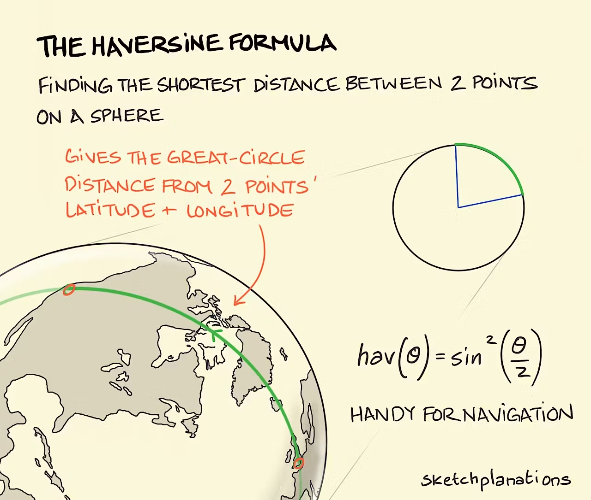

<!--
This README describes the package. If you publish this package to pub.dev,
this README's contents appear on the landing page for your package.

For information about how to write a good package README, see the guide for
[writing package pages](https://dart.dev/tools/pub/writing-package-pages).

For general information about developing packages, see the Dart guide for
[creating packages](https://dart.dev/guides/libraries/create-packages)
and the Flutter guide for
[developing packages and plugins](https://flutter.dev/to/develop-packages).
-->

## flutter_haversine_geolocation

A Flutter/Dart package to manage a geolocation history, using the Haversine formula to filter out nearby points and optimize tracking.

---


### 🚀 Installation

Add this dependency in your pubspec.yaml:

```yaml
dependencies:
  flutter_haversine_geolocation: ^0.0.1
```

Then run:

```bash
flutter pub get
```

---

### ⚡ Quick Start

Here’s the minimal setup to test the package:

```dart
import 'package:flutter_haversine_geolocation/flutter_haversine_geolocation.dart';

void main() async {
  final manager = GeolocationManager(
    GeolocationOptions(
      loadHistory: () async => null, // no persistence for now
      saveHistory: (history) async {}, // no persistence for now
    ),
  );

  await manager.init();

  await manager.addLocation(
    TLocation(
      coords: TCoords(
        accuracy: 5,
        altitude: 30,
        altitudeAccuracy: 1,
        heading: 0,
        latitude: 48.8566,
        longitude: 2.3522,
        speed: 0,
      ),
      mocked: false,
      timestamp: DateTime.now(),
    ),
  );

  print("History length: ${manager.history.locations.length}");
}

```

👉 Run this in a simple dart main.dart file, and you’ll see how the history grows as you add new points.

---

### ✨ Features

- 📍 Calculate distances in meters using the Haversine formula

- 🔄 Manage a geolocation history

- 🎯 Automatically filter out points that are too close to the previous one

- 💾 Flexible persistence (SharedPreferences, SQLite, Hive, etc.)

- 🪶 Lightweight and 100% compatible with Flutter/Dart (mobile, web, desktop)

---

### 🔧 Example Usage

```dart
import 'package:flutter/material.dart';
import 'package:flutter_haversine_geolocation/flutter_haversine_geolocation.dart';
import 'package:shared_preferences/shared_preferences.dart';
import 'dart:convert';

const storageKey = "geolocations";

class MyApp extends StatefulWidget {
  @override
  State<MyApp> createState() => _MyAppState();
}

class _MyAppState extends State<MyApp> {
  late final GeolocationManager manager;

  @override
  void initState() {
    super.initState();
    manager = GeolocationManager(
      GeolocationOptions(
        distanceThreshold: 100,
        loadHistory: () async {
          final prefs = await SharedPreferences.getInstance();
          final data = prefs.getString(storageKey);
          return data != null
              ? TLocationHistory.fromJson(jsonDecode(data))
              : null;
        },
        saveHistory: (history) async {
          final prefs = await SharedPreferences.getInstance();
          await prefs.setString(storageKey, jsonEncode(history.toJson()));
        },
      ),
    );
    manager.init();
  }

  Future<void> _addLocation() async {
    await manager.addLocation(
      TLocation(
        coords: TCoords(
          accuracy: 5,
          altitude: 30,
          altitudeAccuracy: 1,
          heading: 0,
          latitude: 48.8566,
          longitude: 2.3522,
          speed: 0,
        ),
        mocked: false,
        timestamp: DateTime.now(),
      ),
    );
    setState(() {});
  }

  @override
  Widget build(BuildContext context) {
    return MaterialApp(
      home: Scaffold(
        appBar: AppBar(title: Text("Geolocation History")),
        body: Center(
          child: Column(
            mainAxisAlignment: MainAxisAlignment.center,
            children: [
              Text("History: ${manager.history.locations.length} positions"),
              ElevatedButton(
                onPressed: _addLocation,
                child: Text("Add Position"),
              ),
            ],
          ),
        ),
      ),
    );
  }
}

```

---

### 📖 API

`GeolocationManager(GeolocationOptions options)`

#### Options

- distanceThreshold (int, optional) → Threshold in meters to consider two positions the same (default: 100)

- loadHistory: Future<TLocationHistory?> Function() → Function to load the geolocation history

- saveHistory: Future<void> Function(TLocationHistory) → Function to save the history

#### Methods

- Future<void> init() → Initialize and load history

- Future<void> addLocation(TLocation location) → Add a new position (filters out duplicates using Haversine distance)

#### Properties

- history: TLocationHistory → List of stored positions

---

### 🧩 Data Models

`TLocation`

```dart
class TLocation {
  final TCoords coords;
  final bool mocked;
  DateTime timestamp;
}

```

- coords → GPS coordinates and related data

- mocked → whether the location is mocked or real

- timestamp → when the location was recorded

---

`TLocationHistory`

```dart
class TLocationHistory {
  final List<TLocation> locations;
}

```

- locations → list of recorded TLocation objects

---

`GeolocationOptions`

```dart
class GeolocationOptions {
  final int distanceThreshold;
  final Future<TLocationHistory?> Function() loadHistory;
  final Future<void> Function(TLocationHistory) saveHistory;
}

```

- distanceThreshold → meters to consider two positions the same

- loadHistory → function to load saved history (e.g. SharedPreferences, SQLite, Hive…)

- saveHistory → function to persist history

---

### 📐 Distance Calculation (Haversine)

The distance between two GPS points is calculated using the Haversine formula, which computes the great-circle distance on a sphere using latitude and longitude.



This formula is useful for:

- Filtering out GPS points that are too close

- Reducing noise in location tracking

- Optimizing storage and performance

```dart
double getDistanceInMeters(double lat1, double lon1, double lat2, double lon2)

```

---

### 📜 License

MIT 2025
